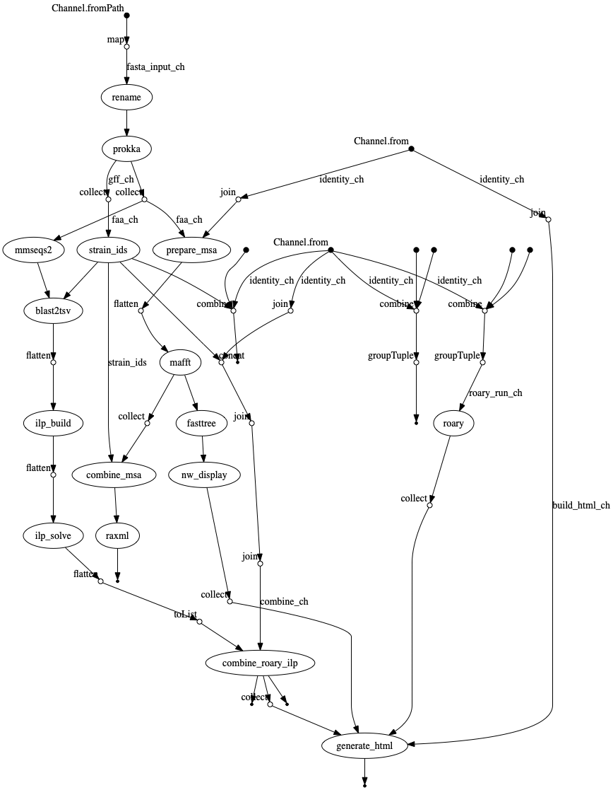

# RIBAP
Roary ILP Bacterial Annotation Pipeline


[](https://twitter.com/martinhoelzer) 
[](https://twitter.com/klamkiewicz) 


**This tool is currently under heavy development, so expect some bugs but feel free to report issues**

Annotate your protein sequences with Prokka and determine a pan genome with Roary. This genome is refined with the usage of ILPs that solve the best matching for each pairwise strain mmseqs2 comparison.

# What is this about?
A common task when you have a bunch of bacterial genomes in your hands is the calculation of a _core gene set_. So, we want to know, which genes are homologous and shared between certain bacteria. However, defining homology only based an sequence 
similarity often underestimates the _true_ core gene set, in particular when diverse species are compared. RIBAP combines sequence homology information from [Roary](https://github.com/sanger-pathogens/Roary) with smart pairwise [ILP](https://www.ncbi.nlm.nih.gov/pmc/articles/PMC4391664/) calculations to produce a more complete core gene set - even on genus level. First, RIBAP performs annotations with [Prokka](https://github.com/tseemann/prokka), calculates the core gene set using [Roary](https://github.com/sanger-pathogens/Roary) and pairwise [ILPs](https://www.ncbi.nlm.nih.gov/pmc/articles/PMC4391664/), and finally visualizes the results in an interactive HTML table garnished with protein multiple sequence alignments and trees. RIBAP comes with Nextflow and Docker/Conda support for easy execution.      

# How can I give it a try?
Easy, you just need a working `nextflow` and `docker` or `conda` installation, see below! You have `nextflow` and `docker`? Give it a try:
```bash
nextflow pull hoelzer-lab/ribap
nextflow run hoelzer-lab/ribap -r 0.6.0 --fasta "$HOME/.nextflow/assets/hoelzer-lab/ribap/data/*.fasta" -profile local,docker
```
You have `nextflow` and `conda`? Okay:
```bash
nextflow run hoelzer-lab/ribap -r 0.6.0 --fasta "$HOME/.nextflow/assets/hoelzer-lab/ribap/data/*.fasta" -profile local,conda
```
You need some of this dependencies? See below. 

## Installation

* runs with the workflow manager `nextflow` using `docker` or `conda`
* this means all programs are automatically pulled via `docker` or `conda`
* only `docker` or `conda` and `nextflow` need to be installed (per default `docker` is used)

### Nextflow
Needed in both cases (`conda`, `docker`)
```bash
sudo apt-get update
sudo apt install -y default-jre
curl -s https://get.nextflow.io | bash 
sudo mv nextflow /bin/
```

### Using Conda

Just copy the commands and follow the installation instructions. Let the installer configure `conda` for you. You need to specify `-profile conde` to run the pipeline with conda support.  
```bash
cd
wget https://repo.anaconda.com/miniconda/Miniconda3-latest-Linux-x86_64.sh
bash Miniconda3-latest-Linux-x86_64.sh
```
See [here](https://docs.conda.io/en/latest/miniconda.html) if you need a different installer besides Linux used above. 

### Using Docker

#### Easy 
If you dont have experience with bioinformatic tools just copy the commands into your terminal to set everything up:
```bash
sudo apt-get install -y docker-ce docker-ce-cli containerd.io
sudo usermod -a -G docker $USER
```
* restart your computer
* try out the installation by entering the following

#### Experienced

**Dependencies**

>   * docker (add docker to your Usergroup, so no sudo is needed)
>   * nextflow + java runtime 
>   * git (should be already installed)
>   * wget (should be already installed)
>   * tar (should be already installed)

* Docker installation [here](https://docs.docker.com/v17.09/engine/installation/linux/docker-ce/ubuntu/#install-docker-ce)
* Nextflow installation [here](https://www.nextflow.io/)
* move or add the nextflow executable to a bin path
* add docker to your User group via `sudo usermod -a -G docker $USER`

# Execution examples

```bash
# Get or update the workflow:
nextflow pull hoelzer-lab/ribap

# Run a specific release.
# Get newest release version automatically or choose one yourself
REVISION=$(nextflow info hoelzer-lab/ribap | sed 's/ [*]//' | sed 's/ //g' | sed 's/\[t\]//g' | awk 'BEGIN{FS=" "};{if($0 ~ /^ *0/){print $0}}' | sort -Vr | head -1)
nextflow run hoelzer-lab/ribap -r $REVISION --help

# Run with RAxML tree calculation and specified output dir:
nextflow run hoelzer-lab/ribap -r $REVISION --fasta '*.fasta' --tree --outdir ~/ribap -w work

# Run with optional reference Genbank file to guide Prokka annotation, ATTENTION: this will use the additional reference file for every input genome!
nextflow run hoelzer-lab/ribap -r $REVISION --fasta '*.fasta' --reference GCF_000007205.1_ASM720v1_genomic.gbff --outdir ~/ribap -w work

# Use list parameter to provide genome FASTAs and corresponding reference GenBank files in CSV format
nextflow run hoelzer-lab/ribap -r $REVISION --list --fasta genomes.csv --reference refs.csv --outdir ~/ribap -w work

# genomes.csv:
#
# genome1,genome1.fasta
# genome2,genome2.fasta
# genome3,genome3.fasta

# refs.csv
#
# genome1,ref.gbff
# genome2,ref.gbff
# 
# Here, genome1 and genome2 will additionally use information from ref.gbff in Prokka annotatio while genome3 will be annotated w/o additional reference information
```

# Flowchart
