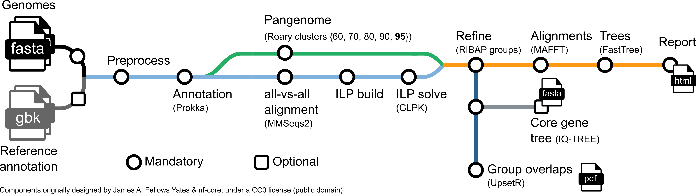

# RIBAP
Roary ILP Bacterial Annotation Pipeline.


[](https://twitter.com/martinhoelzer) 
[](https://twitter.com/klamkiewicz) 

Annotate genes in your bacterial genomes with [Prokka](https://github.com/tseemann/prokka) and determine a pangenome with the great [Roary](https://sanger-pathogens.github.io/Roary/). The initial gene clusters found by Roary are further refined with the usage of ILPs that solve the best matching for each pairwise strain [MMseqs2](https://github.com/soedinglab/MMseqs2) comparison.

1. [ What? ](#about)
2. [ How can I give it a try (Quick start)? ](#quick)
3. [ Execution examples ](#examples)
4. [ Install ](#install)
5. [ Runtime and disk space ](#run)
6. [ Limitations ](#limitations)
7. [ Publication ](#publication)
8. [ References ](#references)

<a name="about"></a>

# What?
A common task when you have a bunch of bacterial genomes in your hands is calculating a _core gene set_ or _pangenome_. So, we want to know, which genes are homologs and shared between a set of bacteria. However, defining homology only based an sequence similarity often underestimates the _true_ core gene set, particularly when diverse species are compared. **RIBAP** combines sequence homology information from [Roary](https://github.com/sanger-pathogens/Roary) with smart pairwise [ILP](https://www.ncbi.nlm.nih.gov/pmc/articles/PMC4391664/) calculations to produce a more complete core gene set - even on genus level. First, RIBAP performs annotations with [Prokka](https://github.com/tseemann/prokka), calculates the core gene set using [Roary](https://github.com/sanger-pathogens/Roary) and pairwise [ILPs](https://www.ncbi.nlm.nih.gov/pmc/articles/PMC4391664/), and finally visualizes the results in an interactive HTML table garnished with protein multiple sequence alignments and trees. RIBAP comes with [Nextflow](https://nextflow.io) and [Docker](docker.com)/[Singularity](https://docs.sylabs.io/guides/3.5/user-guide/introduction.html)/[Conda](https://docs.conda.io/en/latest/) options to resolve all necessary software dependencies for easy execution.      



<a name="quick"></a>

# How can I give it a try?
Glad you're asking. Easy, you just need a working `nextflow` and `docker` or `singularity` or `conda` installation, see below! We recommand the usage of containers! You have `nextflow` and `docker`? Good, give it a try:

```bash
nextflow pull hoelzer-lab/ribap
nextflow info hoelzer-lab/ribap
# select a release version, e.g. 1.0.0
nextflow run hoelzer-lab/ribap -r 1.0.0 --fasta "$HOME/.nextflow/assets/hoelzer-lab/ribap/data/*.fasta" -profile local,docker
```

You have `nextflow` and `conda`? Okay, just change the profile:
```bash
nextflow run hoelzer-lab/ribap -r 1.0.0 --fasta "$HOME/.nextflow/assets/hoelzer-lab/ribap/data/*.fasta" -profile local,conda
```

You need some of these dependencies? Check the end of this README! 

<a name="examples"></a>

# Execution examples

```bash
# Get or update the workflow:
nextflow pull hoelzer-lab/ribap

# Run a specific release, check whats available:
nextflow info hoelzer-lab/ribap

# Or get newest release version automatically and show the help:
REVISION=$(nextflow info hoelzer-lab/ribap | sed 's/ [*]//' | sed 's/ //g' | sed 's/\[t\]//g' | awk 'BEGIN{FS=" "};{if($0 ~ /^ *0/){print $0}}' | sort -Vr | head -1)
nextflow run hoelzer-lab/ribap -r $REVISION --help

# Run with IQ-TREE tree calculation using all identified core genes and specified output dir. 
# Attention: less than 1000 bootstrap replicates (default) can not be used.
# For intermediate files, a work dir via -w is defined.
# Note, that Nextflow build-in parameters use a single dash "-" symbol.   
nextflow run hoelzer-lab/ribap -r $REVISION --fasta '*.fasta' --tree --bootstrap 1000 --outdir ~/ribap -w ribap-work

# the ILPs can take a lot (!) of space. But you can use this flag to keep them anyway. Use w/ cuation!
nextflow run hoelzer-lab/ribap -r $REVISION --fasta '*.fasta' --outdir ~/ribap -w ribap-work --keepILPs

# Run with optional reference GenBank file to guide Prokka annotation.
# ATTENTION: this will use the additional reference file for every input genome!
nextflow run hoelzer-lab/ribap -r $REVISION --fasta '*.fasta' --reference GCF_000007205.1_ASM720v1_genomic.gbff --outdir ~/ribap -w work

# Use list parameter to provide genome FASTAs and corresponding reference GenBank files in CSV format.
nextflow run hoelzer-lab/ribap -r $REVISION --list --fasta genomes.csv --reference refs.csv --outdir ~/ribap -w work

# genomes.csv:
#
# genome1,genome1.fasta
# genome2,genome2.fasta
# genome3,genome3.fasta

# refs.csv
#
# genome1,ref.gbff
# genome2,ref.gbff
# 
# Here, genome1 and genome2 will additionally use information from ref.gbff in Prokka annotation while genome3 will be annotated w/o additional reference information.
```

<a name="install"></a>

# Installation

* runs with the workflow manager `nextflow` using `docker` or `singularity` or `conda`
* this means, all programs are automatically pulled via `docker`, `singularity`, or `conda`
* only `docker` or `sinularity` or `conda` and `nextflow` need to be installed (per default `conda` is used)

**Attention** Use the below installation examples with causion and check you system requirements. Its best to refer to the specific manual of each software. 

## Nextflow
Needed in all cases (`conda`, `docker`, `singularity`)
```bash
sudo apt-get update
sudo apt install -y default-jre
curl -s https://get.nextflow.io | bash 
sudo mv nextflow /bin/
```

## Using Conda

Just copy the commands and follow the installation instructions. Let the installer configure `conda` for you. You need to specify `-profile conda` to run the pipeline with `conda` support. Note, internally the pipeline will switch to `mamba` to faser resolve all environments.   
```bash
cd
wget https://repo.anaconda.com/miniconda/Miniconda3-latest-Linux-x86_64.sh
bash Miniconda3-latest-Linux-x86_64.sh
```
See [here](https://docs.conda.io/en/latest/miniconda.html) if you need a different installer besides Linux used above. 

## Using Docker

If you dont have experience with bioinformatic tools just copy the commands into your terminal to set everything up:
```bash
sudo apt-get install -y docker-ce docker-ce-cli containerd.io
sudo usermod -a -G docker $USER
```
* restart your computer
* try out the installation by entering the following

Docker installation details [here](https://docs.docker.com/v17.09/engine/installation/linux/docker-ce/ubuntu/#install-docker-ce)

<a name="run"></a>

# Runtime and disk space

**Attention:** RIBAP is currently not intended to be used with hundreds or thousands of input genomes (see also [Limitations](#limitations)). Also for smaller input sets, you will need quite some disk space to store the ILPs and their results. Due to that, RIBAP is per default not storing the intermediate ILP files and solutions. You can use `--keepILPs` to store them, if needed. Below, we report runtime and disk space usage on a regular Linux laptop (8 CPUs used) and a HPC (SLURM, pre-configured CPU and RAM usage, runtime may be biased due to HPC work load) using varying numbers of _Chlamydia psittaci_ genomes (~1 Mbp, sampled from [here](https://osf.io/rbca9/)) as input and with and without the `--keepILPs` option. Please also not that we used the default `--chunks 8` value. Especially on a HPC, the runtime can be increased drastically by increasing the `--chunks` value. 

| CPUs | #genomes (1 Mbp) | `--keepILPs` | time | `work` space | `output` space |
| ----------- | ----------- | ----------- | ----------- |  ----------- |  ----------- |
| 8   | 8  | NO   | 24 min     | 1.2 GB     | 195 MB |
| 8   | 8  | YES  | 23 min     | 5.5 GB     | 195 MB |
| 8   | 16 | NO   | 1 h 4 min  | 1.5 GB     | 398 MB |
| 8   | 16 | YES  | 1 h        | **18 GB**  | 398 MB |
| 8   | 32 | NO   | 3 h 10 min | 2.2 GB     | 788 MB |
| 8   | 32 | YES  | 3 h 16 min | **84 GB**  | 789 MB |
| HPC | 8  | NO   | 6 min      | 1.2 GB     | 196 MB |
| HPC | 8  | YES  | 6 min      | 5.5 GB     | 196 MB |
| HPC | 16 | NO   | 17 min     | 1.5 GB     | 400 MB |
| HPC | 16 | YES  | 16 min     | **21 GB**  | 400 MB |
| HPC | 32 | NO   | 1 h 1 min  | 2.2 GB     | 794 MB |
| HPC | 32 | YES  | 1 h 11 min | **83 GB**  | 794 MB |

Commands used (in slight variations): 
```bash
# laptop
nextflow run hoelzer-lab/ribap -r 1.0.0 --fasta '*.fasta' --cores 8 --max_cores 8 -profile local,docker -w work --output ribap-results --keepILPs
# HPC
nextflow run hoelzer-lab/ribap -r 1.0.0 --fasta '*.fasta' -profile slurm,singularity -w work --output ribap-results --keepILPs
```

<a name="limitations"></a>

# Limitations

* The current version of RIBAP is not intended for use with hundreds of input genomes. You can try, but expect a long runtime and high memory requirements (see [Runtime and disk space](#run)). We recommend running RIBAP with less than 100 input genomes and without the `--keepILPs` parameter to save space.
* RIBAP's combination of Roary clusters and ILPs specifically calculates core gene sets for more diverse species. If your input genomes are from the same species, you can also try RIBAP, but you may be better off with tools like [Roary](https://sanger-pathogens.github.io/Roary/), [Panaroo](https://github.com/gtonkinhill/panaroo), or [PPanGGOLiN](https://github.com/labgem/PPanGGOLiN).
* Currently, we do not classify the final RIBAP groups into pangenome categories, such as core and accessory genomes or persistent/shell/cloud. So RIBAP is very useful to get a good idea of a comprehensive set of core genes for different species, and also of other groups that cover only subsets of the input genomes without calling them "accessory" or "shell"/"cloud." Still, tools like the ones above can help you better classify genes into these categories if needed.

<a name="publication"></a>

# Publication
If you find RIBAP useful please cite it in your work:

> Lamkiewicz, K., Barf, LM. & Hölzer, M. (hopefully in 2023!). Pangenome calculation beyond the species level with RIBAP: A comprehensive bacterial core genome annotation pipeline based on Roary and pairwise ILPs
. In prep!

However, RIBAP would not be possible without the help of many great open source bioinformatics tools. Kudos to all the developers and maintainers! **Please cite them in your work as well!** 

<a name="references"></a>

# References
In particular, RIBAP takes advantage of and uses the following tools:

## Roary
> Page, Andrew J., et al. "Roary: rapid large-scale prokaryote pan genome analysis." Bioinformatics 31.22 (2015): 3691-3693.

[Code](https://sanger-pathogens.github.io/Roary/) | [Publication](https://doi.org/10.1093/bioinformatics/btv421)

## Prokka 
> Seemann, Torsten. "Prokka: rapid prokaryotic genome annotation." Bioinformatics 30.14 (2014): 2068-2069.

[Code](https://github.com/tseemann/prokka) | [Publication](https://doi.org/10.1093/bioinformatics/btu153)

## MMSeqs2

> Steinegger, Martin, and Johannes Söding. "MMseqs2 enables sensitive protein sequence searching for the analysis of massive data sets." Nature biotechnology 35.11 (2017): 1026-1028.

[Code](https://github.com/soedinglab/MMseqs2) | [Publication](https://www.nature.com/articles/nbt.3988)

## ILPs

> Martinez FV, Feijão P, Braga MD, Stoye J. "On the family-free DCJ distance and similarity" Algorithms Mol Biol. 2015 Apr 1;10(1):13

[Publication](https://almob.biomedcentral.com/articles/10.1186/s13015-015-0041-9)

## GLPK ILP solver

> Makhorin, Andrew. "GLPK (GNU linear programming kit)." http://www. gnu. org/s/glpk/glpk. html (2008).

* https://www.gnu.org/software/glpk/

## MAFFT

> Katoh, Kazutaka, and Daron M. Standley. "MAFFT multiple sequence alignment software version 7: improvements in performance and usability." Molecular biology and evolution 30.4 (2013): 772-780.

[Code](https://mafft.cbrc.jp/alignment/software/) | [Publication](https://doi.org/10.1093/molbev/mst010)

## FastTree

> Price, Morgan N., Paramvir S. Dehal, and Adam P. Arkin. "FastTree 2 - approximately maximum-likelihood trees for large alignments." PloS one 5.3 (2010): e9490.

[Code](http://www.microbesonline.org/fasttree/) | [Publication](https://doi.org/10.1371/journal.pone.0009490)

## cd-hit

> Limin Fu, Beifang Niu, Zhengwei Zhu, Sitao Wu and Weizhong Li. "CD-HIT: accelerated for clustering the next generation sequencing data." Bioinformatics, (2012), 28 (23): 3150-3152

[Code](https://github.com/weizhongli/cdhit) | [Publication](https://academic.oup.com/bioinformatics/article/28/23/3150/192160)

## IQ-TREE

> Minh, Bui Quang, et al. "IQ-TREE 2: new models and efficient methods for phylogenetic inference in the genomic era." Molecular biology and evolution 37.5 (2020): 1530-1534.

[Code](https://github.com/iqtree/iqtree2) | [Publication](https://doi.org/10.1093/molbev/msaa015)

## UpSetR

> Conway, Jake R., Alexander Lex, and Nils Gehlenborg. "UpSetR: an R package for the visualization of intersecting sets and their properties." Bioinformatics (2017).

[Code](https://github.com/hms-dbmi/UpSetR) | [Publication](https://doi.org/10.1093/bioinformatics/btx364)
