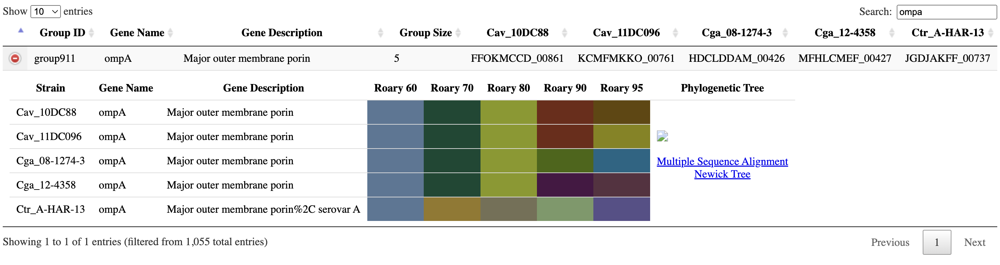
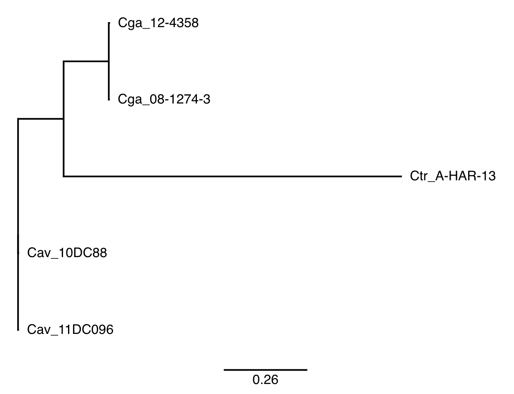
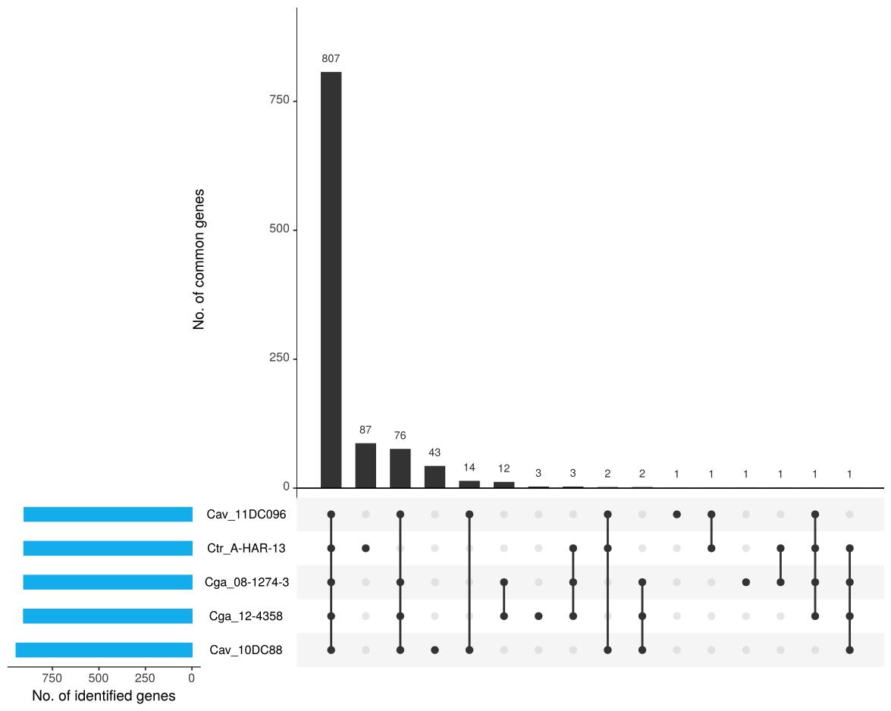

# Example results of the RIBAP pipeline

As input, the five _Chlamydia_ genomes located [here](https://github.com/hoelzer-lab/ribap/tree/main/data) were used.

Used command:

```bash
nextflow run hoelzer-lab/ribap -r 1.0.0 --fasta '../*.fasta' -profile local,docker --tree
```

The example HTML `html-report/ribap.html` does not link to the individual MSAs and trees because they are not located in this GitHub repository. 

The `core_genome-modeltest.treefile` Newick tree file was visualized with [iroki](https://www.iroki.net/).

## HTML report snapshot



## Tree



## UpsetR

